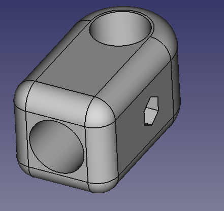
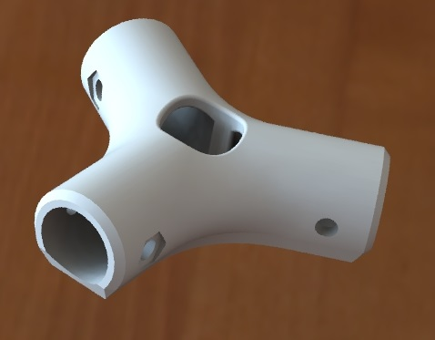

# Satcom antenna project #

## Mechanical ##
### T-joint ###
**T joint v2b**

Source files for the T-joint. This early file was done in [FreeCad](http://www.freecadweb.org/).  The PCV pipes we have are 21.5mm in diameter; the file is intended to be printed with ABS plastic; by experiment, setting the hole size to 22mm worked OK for us and provided a not-too-tight press-fit. 

The item is admitedely badly overengineered - it is heavy and so stiff, that the tightening screw will probably not work. I will probably re-do this part in Solidworks to make it significantly lighter. 

The freecad is an impressive attempt at modern parametric modelling; however, being free, it is not as refined as solidworks (yet). After doing printing this part and explaining to the fablab manager what the project is about, I got a lease of solidworks license. Altough not free, this is a really good, productivity-oriented software, so all the upcoming designs will be done there. I will always post the .stl files too.

Printing with 0.3mm layer thickness yields an OK result.

### Y-joint ###

**Y-joint_v3**

Source files for the Y-joint. There are 3 versions: regular (wall thickness 4mm, ~65 grams of ABS total), medium (wall thickness 3mm) and light (wall thickness 2mm, ~35grams of ABS total). The designs are intended for a low-end 3D printer and I have observed design guidelines from around the web. 

Printing with 0.3mm layer thickness yields an OK result.

